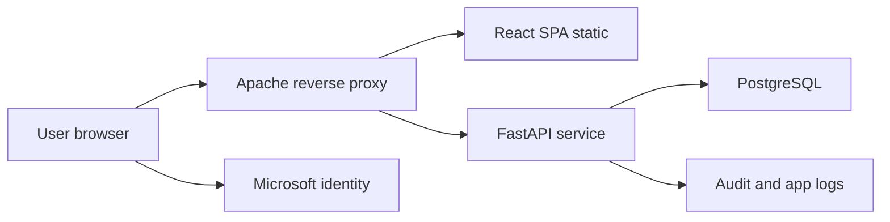
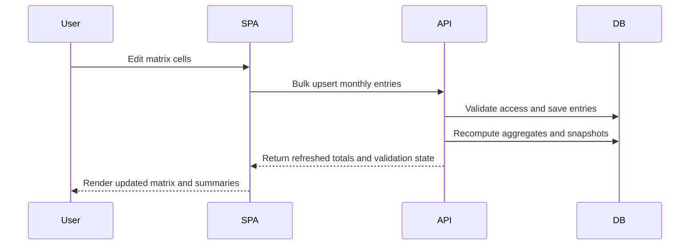

# Cost Planning Platform V1 Delivery Plan

## 1. Confirmed Scope Decisions

- Delivery model: full scope in V1 with no deferral
- Frontend: React with TypeScript as single page app
- Backend: FastAPI
- Database: PostgreSQL
- Runtime and serving: Ubuntu Linux with Apache reverse proxy
- Authentication: Microsoft 365 company domain login
- Role assignment: manual assignment by administrator after first login
- Organization model: multiple business units with strict data separation
- Administration model: global super admin plus business unit admin

## 2. V1 Acceptance Criteria by Feature Group

### Planning and Actuals

1. User can create and maintain separate project plans inside assigned business units
2. Project plan supports monthly effort in person days at task and performer granularity
3. User can enter both planned and actual effort values
4. System guarantees consistency between task totals and performer totals through one source of truth
5. Stage duration bands are visible as colored month segments in the matrix editor

### Finance

1. User can maintain performer rates with effective date ranges
2. User can record financial requests, invoices, payments, and project revenues
3. System computes planned and actual monetary costs from effort and rates
4. Budget realization view shows revenue and cost trends over time

### Reports

1. Report effort planned and actual by performer across months
2. Report effort planned and actual by task across months
3. Report cost planned and actual by performer across months
4. Report cost planned and actual by task across months
5. Reports support on screen view and export to xlsx and csv

### Dashboards

1. Project dashboard shows cumulative planned and actual cost trend
2. Project dashboard shows planned and actual workload trend by performer
3. Project dashboard shows revenue and cost realization trend
4. Business unit dashboard shows aggregated project metrics with same trend families

### Access and Administration

1. Users authenticate through Microsoft 365 account
2. New user has no business data access until role assignment
3. Super admin can manage all business units and user assignments
4. Business unit admin can manage users and projects only in assigned business units
5. Editor can edit planning actuals finance data in assigned business units
6. Viewer has read only access and can run reports and dashboards

## 3. Domain and Module Boundaries

### Backend Domains

- Identity and Access
- Organization and Project Setup
- Planning and Execution
- Finance and Budget
- Reporting and Dashboards
- Audit and Operations

### Frontend Domains

- Session and Access shell
- Business unit and project workspace
- Matrix editor
- Finance register
- Reports center
- Dashboards center
- Admin center

## 4. End to End Architecture and Data Flow

## 5. Role and Permission Matrix

| Action | Super admin | Business unit admin | Editor | Viewer |
| --- | --- | --- | --- | --- |
| Manage business units | yes global | no | no | no |
| Assign roles | yes global | yes scoped | no | no |
| Create and edit projects | yes global | yes scoped | yes scoped | no |
| Edit matrix plans | yes global | yes scoped | yes scoped | no |
| Edit matrix actuals | yes global | yes scoped | yes scoped | no |
| Edit rates | yes global | yes scoped | yes scoped | no |
| Edit financial documents | yes global | yes scoped | yes scoped | no |
| View reports and dashboards | yes | yes | yes | yes scoped |
| Export reports | yes | yes | yes | yes |
| View audit trail | yes global | yes scoped | no | no |

## 6. PostgreSQL Logical Schema

### Core Organization

- business_units
  - id
  - code unique
  - name
  - active

- users
  - id
  - microsoft_oid unique
  - email unique
  - display_name
  - status
  - last_login_at

- role_assignments
  - id
  - user_id
  - business_unit_id nullable for global super admin
  - role super_admin bu_admin editor viewer
  - active
  - unique user role business_unit

### Project Structure

- projects
  - id
  - business_unit_id
  - code unique within business unit
  - name
  - description
  - start_month
  - end_month
  - status

- project_stages
  - id
  - project_id
  - name
  - start_month
  - end_month
  - color_token
  - sequence_no

- performers
  - id
  - business_unit_id
  - external_ref optional
  - display_name
  - active

- tasks
  - id
  - project_id
  - stage_id
  - code unique within project
  - name
  - sequence_no
  - active

- task_performer_assignments
  - id
  - task_id
  - performer_id
  - unique task performer

### Effort and Cost Inputs

- effort_monthly_entries
  - id
  - project_id
  - task_id
  - performer_id
  - month_start
  - planned_person_days numeric
  - actual_person_days numeric
  - unique project task performer month

- performer_rates
  - id
  - business_unit_id
  - performer_id
  - project_id nullable for default rate
  - rate_unit day or fte_month
  - rate_value
  - effective_from_month
  - effective_to_month nullable

- financial_requests
  - id
  - project_id
  - request_no
  - request_date
  - month_start
  - amount
  - currency
  - status

- invoices
  - id
  - project_id
  - invoice_no
  - invoice_date
  - month_start
  - amount
  - currency
  - payment_status
  - payment_date nullable

- revenues
  - id
  - project_id
  - revenue_no
  - recognition_date
  - month_start
  - amount
  - currency

### Derived and Audit

- project_monthly_snapshots
  - id
  - project_id
  - month_start
  - planned_person_days
  - actual_person_days
  - planned_cost
  - actual_cost
  - revenue_amount
  - invoice_amount
  - cumulative_planned_cost
  - cumulative_actual_cost
  - cumulative_revenue
  - unique project month

- audit_events
  - id
  - actor_user_id
  - business_unit_id
  - entity_name
  - entity_id
  - action_type
  - before_payload jsonb
  - after_payload jsonb
  - created_at

## 7. Data Integrity and Index Strategy

1. Use foreign keys across all domain links
2. Use unique constraints for identities, project codes, assignment granularity, and monthly entry granularity
3. Add check constraints for non negative effort and cost values
4. Add indexes on business_unit_id, project_id, performer_id, month_start for analytics
5. Add composite indexes for report filters
6. Use row level filtering in service layer and optional PostgreSQL row security policies for strict separation

## 8. Consistency and Calculation Rules

### Source of Truth

- Single editable source: effort_monthly_entries rows at task performer month level
- Task monthly totals are derived by sum over performers
- Performer monthly totals are derived by sum over tasks

### Validation

1. month_start must be first day of calendar month
2. planned and actual person days must be greater or equal zero
3. edits outside project month range are rejected
4. edits for inactive task or performer are rejected
5. access outside assigned business units is rejected

### Cost Rules

1. planned_cost_cell equals planned_person_days multiplied by resolved rate
2. actual_cost_cell equals actual_person_days multiplied by resolved rate
3. resolved rate chooses project specific rate first then business unit default rate
4. fte_month rate uses configurable working day divisor per month
5. cumulative values are rolling sums ordered by month

### Budget Realization

1. monthly_margin equals revenue minus actual_cost
2. cumulative_margin equals cumulative_revenue minus cumulative_actual_cost
3. realization_percent equals cumulative_actual_cost divided by cumulative_revenue with divide by zero guard

## 9. FastAPI API Contract Map

### Identity and Session

- GET api v1 me
- GET api v1 access context

### Administration

- GET api v1 business-units
- POST api v1 business-units
- GET api v1 users
- POST api v1 users role-assignments
- PATCH api v1 users role-assignments id

### Project Setup

- GET api v1 business-units id projects
- POST api v1 business-units id projects
- GET api v1 projects id
- PATCH api v1 projects id
- POST api v1 projects id stages
- POST api v1 projects id tasks
- POST api v1 projects id performers

### Matrix and Finance

- GET api v1 projects id matrix
- PUT api v1 projects id matrix entries bulk
- GET api v1 projects id rates
- PUT api v1 projects id rates entries bulk
- GET api v1 projects id financial-requests
- POST api v1 projects id financial-requests
- GET api v1 projects id invoices
- POST api v1 projects id invoices
- GET api v1 projects id revenues
- POST api v1 projects id revenues

### Reporting and Dashboards

- GET api v1 reports projects id effort by-performer
- GET api v1 reports projects id effort by-task
- GET api v1 reports projects id cost by-performer
- GET api v1 reports projects id cost by-task
- GET api v1 dashboards projects id
- GET api v1 dashboards business-units id
- GET api v1 exports report-key format xlsx or csv

## 10. Backend Service Architecture

- api layer with request validation and permission guards
- application layer orchestrating use cases and transactions
- domain layer for calculation and consistency policies
- repository layer for PostgreSQL access
- aggregation jobs triggered on write for snapshot refresh
- audit interceptor for all mutating endpoints

Transaction boundary rule:
- one write request commits raw row changes plus affected monthly snapshots atomically

## 11. React Application Structure

### Route Map

- sign in callback route
- app shell route
  - business unit dashboard
  - project list
  - project workspace
    - matrix
    - finance
    - reports
    - dashboard
    - settings
  - admin center

### Frontend Architecture

- Feature folders by domain
- Shared component library for table cells charts filters dialogs
- Query cache for server state
- Local state store for matrix editing session
- Permission driven navigation and action guards

## 12. Monthly Matrix Editor Behavior

1. Columns are calendar months in selected horizon
2. Rows are hierarchical: stage then task then performer
3. Stage duration range is rendered as color band over month columns
4. Editable cells exist on performer rows for planned and actual modes
5. Task rows and stage rows display read only aggregated totals
6. Row and column totals update after every successful save
7. Bulk paste supports spreadsheet like editing with validation feedback
8. Invalid cells are highlighted with precise error reason

## 13. Report Specifications

### Effort Reports

- by performer monthly matrix
  - rows performers
  - columns months
  - values planned actual variance

- by task monthly matrix
  - rows tasks
  - columns months
  - values planned actual variance

### Cost Reports

- by performer monthly matrix
  - rows performers
  - columns months
  - values planned cost actual cost variance

- by task monthly matrix
  - rows tasks
  - columns months
  - values planned cost actual cost variance

## 14. Dashboard Specifications

### Project Level

- cumulative planned vs actual cost line chart
- planned vs actual workload stacked or grouped by performer over months
- cumulative revenue vs cumulative cost and margin trend

### Business Unit Level

- aggregated cumulative planned vs actual cost over all projects
- workload heatmap by performer and month across projects
- revenue vs cost realization trend per project and total

## 15. Microsoft 365 Login and Provisioning Flow

1. SPA starts Microsoft login flow
2. ID token and access context are validated in backend
3. User record is created on first login with no data roles
4. Super admin or business unit admin assigns scoped roles
5. Effective permissions are attached to session context for every API call

## 16. Nonfunctional Quality Standards

### Compatibility and UX

- supported browsers latest stable Chrome Edge Firefox
- dense table interactions optimized for keyboard and mouse
- color palette with clear semantic mapping for plan actual warning error
- accessible labels and focus management for key workflows

### Performance and Security

- paged and filtered API access for large datasets
- bulk endpoint patterns for matrix saves
- strict authorization checks at endpoint and query layer
- structured logging with trace id correlation
- immutable audit for data changing actions

## 17. Deployment and Operations Plan

### Ubuntu and Apache

1. Apache serves SPA build and proxies api path to FastAPI service
2. FastAPI runs under process supervisor with restart policy
3. TLS termination and security headers configured in Apache
4. Environment variables and secrets managed outside source tree

### PostgreSQL Operations

1. schema migrations through controlled migration pipeline
2. scheduled logical backups plus restore verification
3. retention policy for backups and audit data
4. monitoring of connection health slow queries and storage growth

## 18. Testing Strategy

1. Unit tests for calculation formulas and consistency rules
2. Integration tests for API contracts and role enforcement
3. End to end tests for matrix editing reports and dashboards
4. Cross browser verification for Chrome Edge Firefox
5. Data migration and rollback tests for PostgreSQL evolution

## 19. Implementation Backlog for Code Mode

### Milestone 1 Foundation

- scaffold frontend and backend projects
- establish shared domain glossary and constants
- set up database migration framework
- implement auth skeleton and access context

### Milestone 2 Access and Core Data

- implement business unit and role assignment modules
- implement project stage task performer management
- enforce scoped access filters across all queries

### Milestone 3 Matrix and Calculations

- implement matrix read and bulk save endpoints
- implement consistency validations and aggregate computations
- implement rate resolution and cost calculations

### Milestone 4 Finance Reports Dashboards

- implement financial requests invoices revenues modules
- implement report query endpoints and export
- implement project and business unit dashboards

### Milestone 5 Hardening and Release

- finalize audit coverage and observability
- execute test strategy and defect closure
- complete deployment automation and rollback readiness

